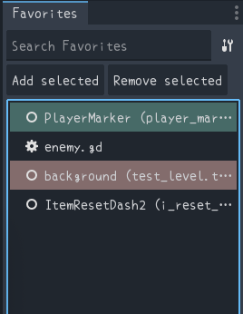

# Favorites Plugin for Godot

## A simple and efficient favorites plugin for Godot Editor that allows you to bookmark scene nodes and files for quick navigation.

## Preview

## Features
- **Bookmark Nodes & Files**: Add scene nodes and project files to your favorites
- **Customizable Colors**: Set distinct colors by right-click upon item
- **Reorder**: Easily move items up or down in the list by drag or `CMD / CTRL + ⬆⬇`
- **Quick Navigation**: Double-click to instantly jump to bookmarked items
  - **Nodes**: Selects the node in scene tree (opens scene editor if needed)
  - **Scripts**: Opens in script editor (opens script editor if needed)
  - **Other files**: Locates in file system
- **File Type Icons**: Different icons for scripts, scenes, resources, and other file types
- **Customizable Behaviour**: Configure default action when double-clicking
- **Search**: Filter favorites with built-in search functionality
- **Persistent Storage**: Favorites are saved and restored between editor sessions

## Installation

1. Copy the `favorites` folder to your project's `addons` directory
2. Enable the "Favorites" plugin in Project Settings
3. The Favorites panel will appear in the editor's left dock area

## Usage

### Adding Favorites

- **Nodes**: Select a node in the scene tree → click "Add Current" or right-click → "Add to Favorites"
- **Files**: Select files in the file system dock → click "Add Current" or right-click → "Add to Favorites"
- **Scripts**: While editing a script → click "Add Current"

### Navigation

Double-click any favorite item:
- **Nodes**: Selects the node in scene tree (opens scene if needed)
- **Scripts**: Opens in script editor
- **Scenes**: Opens in scene editor
- **Other files**: Locates in file system

### Management

- **Search**: Use the search box to filter favorites
- **Remove**: Select item → click "Remove" button
- **Colors**: Right-click items to set custom colors
- **Reorder**: Drag and drop or selct an item then press `CMD / CTRL + ⬆⬇`

## File Types Supported

- Scene files (`.tscn`)
- Script files (`.gd`, `.cs`)
- Resource files (`.tres`, `.res`)
- Image files (`.png`, `.jpg`, `.svg`)
- Audio files (`.wav`, `.ogg`, `.mp3`)
- Text files (`.txt`, `.md`, `.json`)
- All other project files

## Data Storage

Favorites are stored in `user://favorites.json` and remain separate between projects.

## License

This plugin is released under the MIT License.

## Q&A
- **Q**: How do I reset the favorites list?
  - **A**: Delete the `user://favorites.json` file
- **Q**: Can I use this plugin in my commercial projects?
  - **A**: Yes, you can use it in any project.
- **Q**: How do I publish this plugin to the Godot Asset Library?
  - **A**: Follow the [official tutorial](https://docs.godotengine.org/en/stable/community/asset_library/submitting_to_assetlib.html)
